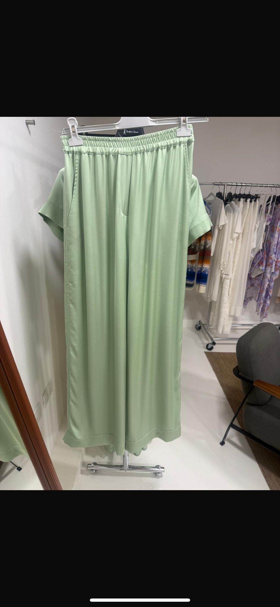
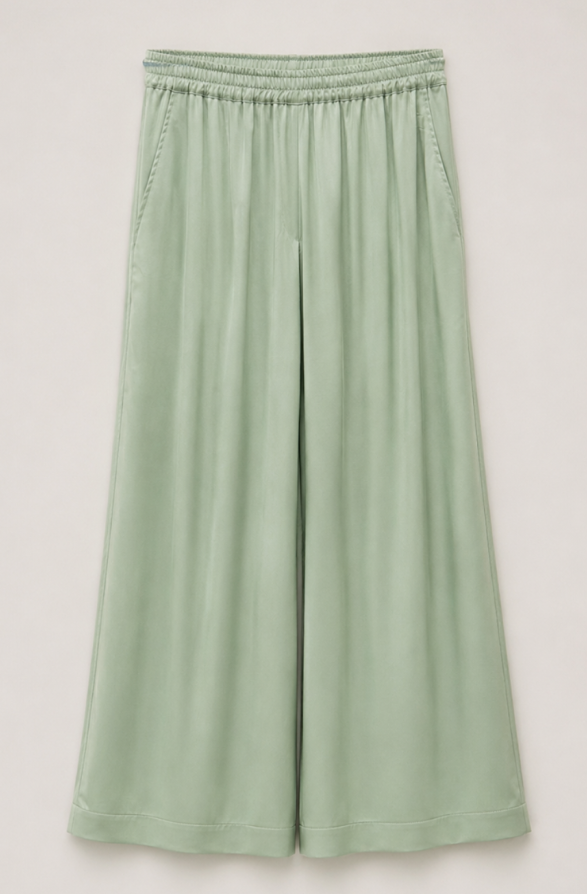

# Demo Scenario — Natural Language Request to Product-Ready Output

This scenario shows a simple, concrete example of the content-generation workflow in action: a non-technical user submits a short natural-language request, and the workflow turns it into a structured, faithful AI image-generation instruction that produces a cleaner, more presentation-ready result.

## Input

- **Raw photo:** a pair of wide-leg trousers photographed on a hanger in a showroom / workshop setting. The shot includes real-world clutter — a clothing rail with other garments, fixtures, and furniture in the background — and uneven lighting typical of an on-the-spot photo.
- **User request:** *"This pair of trousers, ironed and clean."*

The user provides only the image and a short sentence in plain language. No prompt writing, technical parameters, or AI knowledge is required.

## What the System Does

The workflow converts the simple natural-language instruction into a **structured image-generation instruction** suited to faithful product imagery. Conceptually, it interprets the request, identifies the garment as the subject to preserve, and frames an instruction aimed at presentation quality rather than alteration.

The goal is to:

- **Preserve garment identity** — keep the same item: color, material, cut, and silhouette.
- **Improve presentation quality** — produce a cleaner, catalog-style result without the surrounding clutter.
- **Respect the request** — apply what the user asked for ("ironed and clean") without changing the product itself.
- **Stay accessible to non-technical users** — handle the prompt structuring behind the scenes so the user never has to.

The exact prompt structure and instructions are intentionally not shown here (see [`what-is-not-public.md`](./what-is-not-public.md)).

## Output

The result is a cleaner, more **presentation-ready** product image: the trousers are shown on a plain, neutral background, well-presented and free of the original background distractions, while remaining visually faithful to the original garment. The transformation targets presentation and context, not the product itself.

## Why This Matters

- **Simple interaction for non-technical users** — a short sentence and an image are enough; no familiarity with AI tools is needed.
- **No prompt engineering required from the user** — the workflow handles the structuring of a faithful image-generation instruction.
- **Improved content-production efficiency** — raw, on-the-spot photos can be turned into more usable images without a full studio setup.
- **More usable outputs for brand / catalog / e-commerce contexts** — cleaner, more consistent product visuals that fit presentation needs.

This example illustrates the core value of the project: making practical, brand-consistent content production accessible through plain language, while keeping a human in the loop for final validation.
