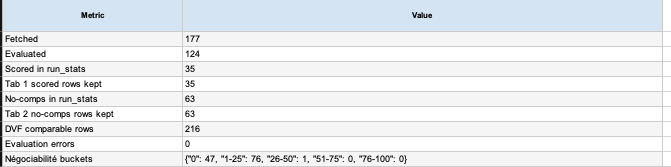
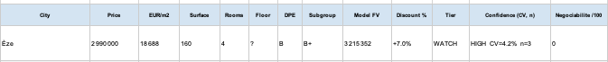

# Demo Scenario — Real Estate Sourcing Model Run

This scenario shows a concrete, **redacted** example of the real estate sourcing workflow in action. It is presented as a **supervised model run / prototype**, not a production-grade or autonomous system. The goal is to illustrate how a batch of opportunities is fetched, structured, evaluated, and prepared for expert human review.

## Input

The workflow starts from a **batch of real estate opportunities** collected from defined sources. Each opportunity enters the pipeline as raw input and is normalized into a consistent internal format before evaluation.

The exact sourcing methods, source URLs, private databases, and proprietary scoring logic are intentionally not disclosed (see [`what-is-not-public.md`](./what-is-not-public.md)).

## Run Overview

This run demonstrates the workflow's ability to:

- **Fetch a batch** of opportunities from defined sources;
- **Evaluate and structure** listings into a consistent format;
- **Separate scored opportunities** from listings without enough comparables;
- **Use comparable data** where it is available;
- **Produce a reviewable output** designed for human feedback.

Example run statistics from this redacted run:

- **177** opportunities fetched;
- **124** evaluated;
- **35** scored rows kept;
- **63** no-comparable rows kept;
- **216** comparable rows generated;
- **0** evaluation errors.

Opportunities are grouped into **negotiation score buckets** that organize them by follow-up priority. These buckets help a reviewer focus attention first on the opportunities most worth pursuing, without exposing the underlying scoring logic.

## Sample Output

For each opportunity, the model produces a **structured row** that makes listings directly comparable. Fields include, for example:

- **City**
- **Price**
- **Price per square meter**
- **Surface**
- **Model fair value**
- **Discount** (vs. model fair value)
- **Confidence level**
- **Opportunity tier**
- **Renovation signal**
- **Negotiation score**
- **Human feedback fields**

The screenshot shows one **anonymized example** row (e.g. a listing in Èze) to illustrate the structure. The underlying listing URL and any identifying details are not included.

## Human Feedback Loop

This output is **not** designed to make autonomous decisions. It is built to **support expert review**: the structured rows give a reviewer a consistent basis for judgment, and the final call always remains human.

Within the output, a reviewer can:

- **Validate or adjust** the model fair value;
- **Flag** an opportunity for attention;
- **Define a target buy price**;
- **Comment on condition**;
- **Confirm or correct** the subgroup classification;
- **Add qualitative feedback**.

This keeps human expertise in control while letting automation handle the repetitive structuring and pre-evaluation.

## Why This Matters

- **Higher throughput in sourcing** — a larger batch of opportunities can be processed and pre-organized.
- **More structured opportunity review** — every listing is represented consistently.
- **Consistent comparison across listings** — standardized fields make opportunities directly comparable.
- **Faster prioritization** — follow-up priority is surfaced so attention goes where it matters first.
- **Better collaboration between automation and human expertise** — automation prepares; the expert decides.

This run illustrates the core value of the project: turning a noisy, high-volume stream of opportunities into a structured, prioritized, reviewable shortlist, while keeping a human firmly in the loop.
